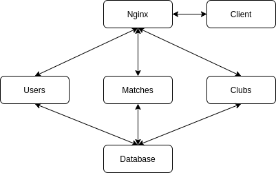

# Distributed Systems Football League
## Architecture
The application consists of 6 services: 
- Matches: Contains all api endpoints and models for matches and things related to matches (matches, match status, referees, divisions)
- Clubs: Contains all api endpoints and models for clubs and things related to clubs (clubs, teams)
- Users: Contains all api endpoints and models for users (incl. authentication)
- Client: Contains the frontend of the service
- Nginx: Functions as a dispatcher to determine which requests have to go to which container
- Database (users-db): The database containing all information from the system

In the schema below, you can see which containers talk to each other. Every incoming request goes to nginx. Depending on the request, they get redirected to the Client, Matches, Clubs or Users container. The Clubs, Users and Matches containers communicate with the database to store their information. Client communicates with nginx to get information from the other services.



# Running
Copy your openweathermap API key from https://home.openweathermap.org/api_keys in `services/client/project/api/api_key.py`. Be sure the Docker and Docker-compose are installed on your machine. 
Once this is done, you can install, seed and run everything using `./install.sh`. To ensure the installation didn't cause any problems, it's recommended to run `./test.sh`. 

# Tools not in assignment
There where some Python libraries used that weren't used in the `testdriven.io` tutorial, but those get installed automatically when running the docker container. The used tools contain Docker, Docker-compose, geopy, openweathermap, flask, flask-testing, flask-sqlalchemy, ...

# API Endpoints
Here is a list of what endpoints are available, a description of what they do and an explanation of what the json contains if the endpoint is called succesfully. Because most of those endpoints are self-explanatory, there isn't always a detailed description. You can also take a look at the code or contact me when something is unclear.

# Design choices
## Architecture
I've decided to make a service of things that where closely related. This was something I liked betwee too much servers for every small thing and not enough services. I've decided to let all request pass the nginx dispatcher service to get a clear overview of which requests goes where. I've also decided to only use one database service for Users, Matches and Clubs.
## API Calls
Besides the CRUD operation, I've added API endpoints that seemed useful to me for the requirements from the assignment.


## User-related
### Users
- [GET] /users/ping
    - Returns json containing: 
        ```json
        {
        'status': 'success',
        'message': 'pong!'
        }
        ```
    - Can be used to check whether you can acces the /users endpoints
- [POST] /users
    - Creates a new user. Should include a payload containing the username. password, team_id, email and type can also be included, but have a default value. username must be unique. 
    - Example response:
        ```json
        {
            'status': 'success',
            'message': 'user12 was added!'
        }
        ```
- [GET] /users/<user_id>
    - Returns information about the user with the given id.
    - the 'data' part of the json contains the attributes from the user.
- [POST] /users/authenticate
    - Payload should contain the username and password you want to authenticate
    - If the authentication is succesful, the response code is 200 and the 'data' part of the json will contain the information about the user.
- [GET] /users
    - Return a json containing all users
    - The 'data' part of the json contains all attributes of each user in json format
- [PUT] /users/<obj_id>
    - Update attributes of the user with given id
    - All attributes you want to update must be provided in the json
- [DELETE] /users/<obj_id>
    - Deletes the user with given id
## Matches-related
### Referees
- [GET] /referees/ping
    - Returns json containing: 
        ```json
        {
        'status': 'success',
        'message': 'pong!'
        }
        ```
    - Can be used to check whether you can acces the /referees endpoints
- [POST] /referees
    - Creates a new referee. All required attributes must be in the payload. Other attributes can also be added.
- [GET] /referees/<referee_id>
    - Returns the attributes of the referee with given id
- [GET] /referees
    - Returns all attributes from all referees
- [PUT] /referees/<obj_id>
    - Update attributes from the referee with given id
- [DELETE] /referees/<obj_id>
    - Deletes the referee with given id. 
### Matches
- [GET] /matches/ping
    - Returns json containing: 
        ```json
        {
        'status': 'success',
        'message': 'pong!'
        }
        ```
    - Can be used to check whether you can acces the /matches endpoints
- [POST] /matches
    - Adds a match. Be sure to provide all required attributes in the payload.
- [GET] /matches/<match_id>
    - Returns attributes from the match with given id
- [PUT] /matches/<match_id>
    - Updates the attributes in the payload from match with given id
- [DELETE] /matches/<match_id>
    - Deletes the match with given id
- [GET] /matches
    - Returns all attributes from all matches
- [GET] /matches/stats/<team1>/vs/<team2>
    - Returns statistics for a match between the teams with the provided id's
- [GET] /matches/recent/<team1>
    - Returns the last 3 matches and all upcoming matches for the team with provided id
- [GET] /matches/home/<team1>
    - Returns all home matches for the team with given id
- [GET] /matches/week/<week_id>
    - Returns all matches in a given matchweek
### Divisions
- [GET] /divisions/ping
    - Returns json containing: 
        ```json
        {
        'status': 'success',
        'message': 'pong!'
        }
        ```
    - Can be used to check whether you can acces the /divisions endpoints
- [POST] /divisions
    - Adds a new division. Be sure to provide all required attributes in the payload.
- [GET] /divisions/<division_id>
    - Returns the attributes of the division with given id
- [GET] /divisions
    - Returns all the divisions and their attributes
- [GET] /divisions/<division_id>/fixtures
    - Returns all matches in the division with given id
- [GET] /divisions/<division_id>/fixtures/<team_id>
    - Returns all matches in the division with given id in which the team of which the id is given plays
- [GET] /divisions/<division_id>/league_table
    - Returns the league table of the division of which the id is given.
- [GET] /divisions/<division_id>/stats
    - Returns statistics of the division with given id (best attack, best defense and most clean sheets)
- [PUT] /divisions/<obj_id>
    - Updates the attributes of the division with given id
- [DELETE] /divisions/<obj_id>
    - Deletes the division with given id
## Clubs-related
### Teams
- [GET] /teams/ping
    - Returns json containing: 
        ```json
        {
        'status': 'success',
        'message': 'pong!'
        }
        ```
    - Can be used to check whether you can acces the /teams endpoints
- [POST] /teams
    - Adds a new team
- [GET] /teams/<team_id>
    - Get the attributes of the team with given id
- [GET] /teams
    - Returns all teams and their attributes
- [PUT] /teams/<obj_id>
    - Updates provided attribute in the team with given id
- [DELETE] /teams/<obj_id>
    - Deletes the team with provided id
### Clubs
- [GET] /clubs/ping
    - Returns json containing: 
        ```json
        {
        'status': 'success',
        'message': 'pong!'
        }
        ```
    - Can be used to check whether you can acces the /clubs endpoints
- [POST] /clubs
    - Adds a club with provided attributes
- [GET] /clubs/<club_id>
    - Returns the parameters of the club with given id.
- [GET] /clubs/<club_id>/teams
    - returns all teams for a given club
- [GET] /clubs
    - returns all clubs and their attributes
- [PUT] /clubs/<obj_id>
    - updates the attributes of club with given id
- [DELETE]
    - deletes the club with given id
## Frontend
- [GET] /web/ping
    - Test wether you can acces the client
- [GET] /web/divisions
    - Front end list of all divisions
- [GET, POST] /web/login
    - Login page
- [GET, POST] /web/logout
    - Logs the currently logged in user out
- [GET, POST] /team_admin
    - An admin interface for teams where they can update scores of their home matches and edit their club information.
- [GET] /web/teams
    - Gives an overview of all teams
- [GET] /web/teams/<team_id>
    - Gives an overview of the last 3 matches of a team, their upcoming matches and team info.
- [GET] /web/divisions/<division_id>
    - Gives details about a specific division
- [GET] /web/matches/<fixture_number>
    - Gives info about a specific match, including weather condition and statistics if the match is in the (near) future
### Admin
Those endpoints are only accessible when logged in as admin or superadmin.
- [GET, POST] /web/admin/matches
    - Provides an admin interface for all matches. This also allows you to filter matches on matchweek and assign referees. 
- [GET, POST] /web/admin/divisions
    - Provides an admin interface for divisions (with all CRUD operations)
- [GET, POST] /web/admin/referees
    - Provides an admin interface for referees (with all CRUD operations)
- [GET, POST] /web/admin/clubs
    - Provides an admin interface for clubs (with all CRUD operations)
- [GET, POST] /web/admin/teams
    - Provides an admin interface for teams (with all CRUD operations)
- [GET, POST] /web/admin/users
    - Provides an admin interface for users (with all CRUD operations)
    - Only superadmins can view/edit the type of users here
    
## Warning
This project is made for the course Distributed Systems. Security is not part of this course, so the project contains some serious security flaws (e.g. Clear text passwords). Don't use this in a real-world project.